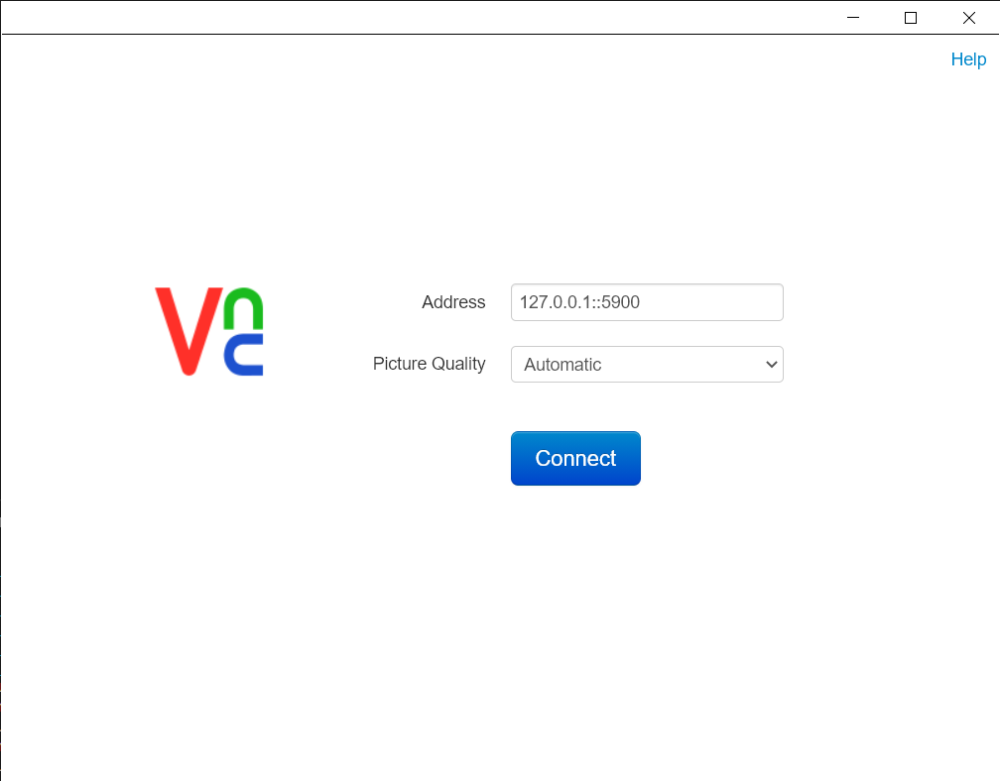
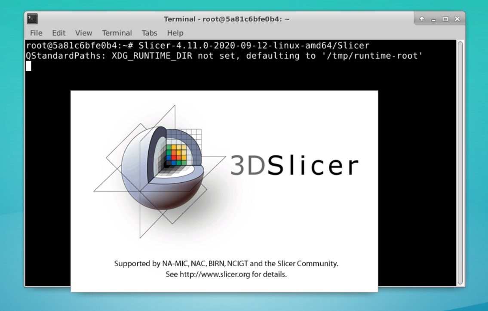
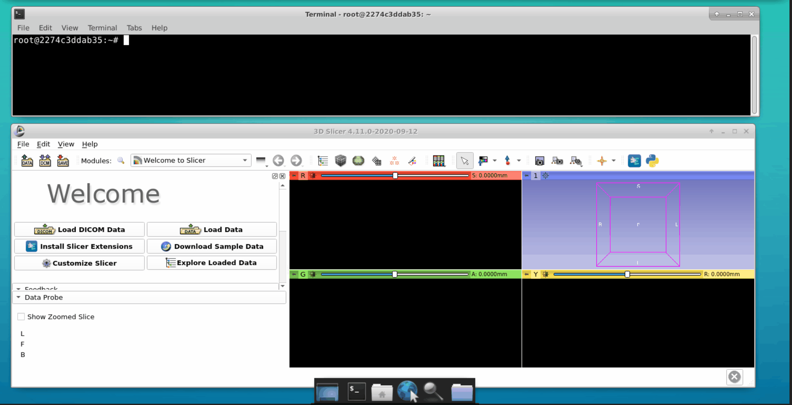

# qStudy
A web app to conduct studies for medical images made using magic of 3d slicer, VNC and web apps.

## Installation
To proceed with installation `docker` and `docker-compose` are required.

Build the docker image from the `docker-compose.yml` file as follows:
```
docker-compose build
```

## Usage

1. Create a `data` direcotry and move all the DICOM files to that `data` folder.

    We mount this volume to the `data` directory inside the docker container.

2. Create and run a docker container based on the docker image we build.

Run with logs.
```
docker-compose up.
```

Run in the detached mode.
```
docker-compose up -d
```

3. Once docker container is up and running, 3d slicer can be accessed via VNC viewer at `127.0.0.1:5900`.



**Note: The default password for VNC viewer is `vncpassword@123` which can be configured in `docker-compose.yml` before building a docker image.**

4. Open termnial and start 3d Slicer by executing the following in the cmd:

```
Slicer-4.11.0-2020-09-12-linux-amd64/Slicer
```



5. Open a new tab in the terminal and interact with the Flask API. We can load data into the 3d slicer tool as follows:



*Note: In case of a failure or issues faced, perform `docker-compose down` and `docker-compose up`.*